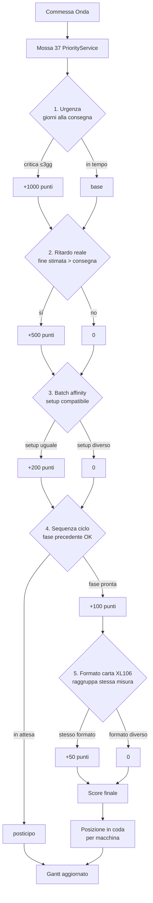
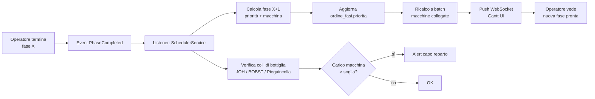
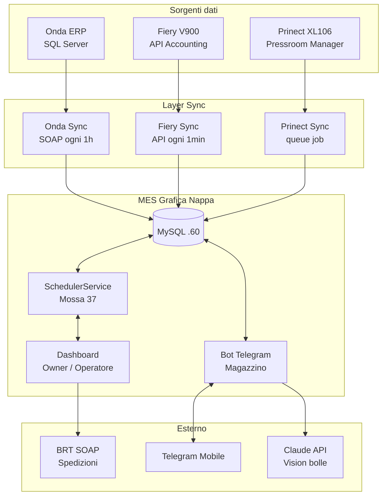
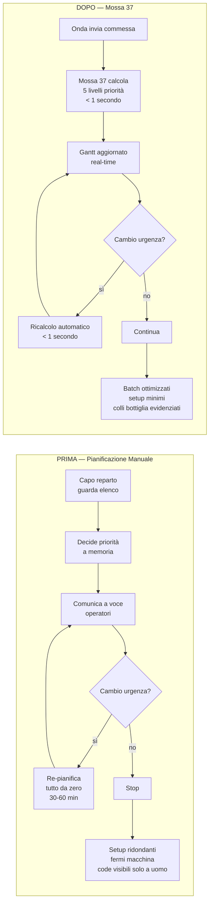

# Demo Mossa 37 — Flowchart

Render: VSCode estensione "Markdown Preview Mermaid" oppure https://mermaid.live/

---

## 1. Decisione Priorità (5 livelli)

---

## 2. Propagazione Fasi (event-driven)

---

## 3. Architettura Sistema

---

## 4. Confronto: Manuale vs Mossa 37

---

## Note demo

**Apertura demo (2 min)**
- Mostra dashboard Owner attuale con tabella commesse
- Spiega: oggi capo reparto pianifica a memoria

**Mossa 37 live (5 min)**
- Apri `/owner/scheduling`
- Mostra Gantt Per Macchina (5 giorni)
- Filtra "Solo critiche" → mostra urgenze
- Cambia priorità manuale 1 commessa → ricalcolo automatico
- Mostra KPI (commesse attive, in tempo, ritardo, ore stimate)

**Q&A (3 min)**
- Costo Claude API per AI bolle: ~3€/1000 bolle
- Roadmap: integrazione magazzino completa, dashboard cliente

**Materiali fisici**
- Non servono. Tutto live in browser.
- Eventuale: stampa flowchart 1+4 (priorità + confronto) come supporto.
