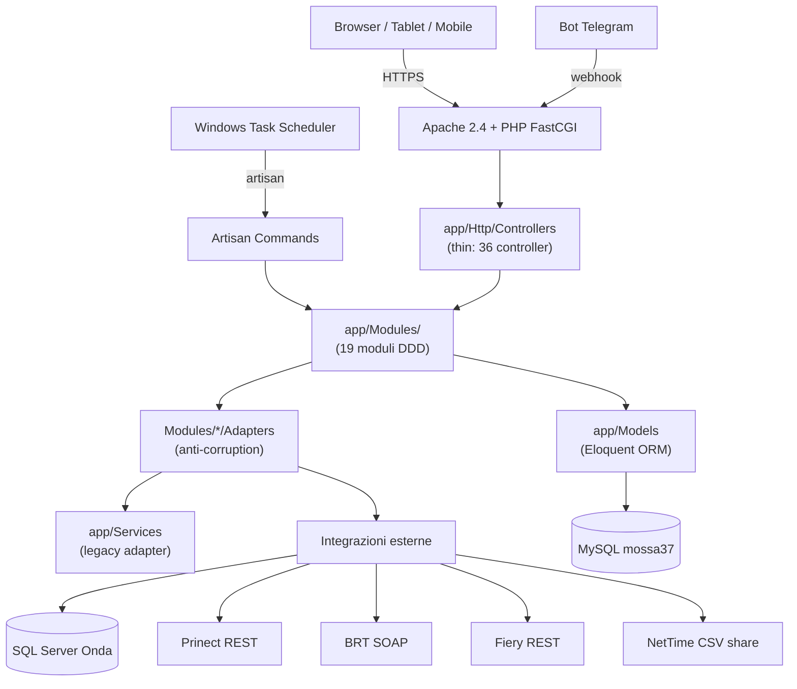

# 02. Architettura

## Pattern: monolite modulare DDD-lite

L'app è un **monolite Laravel 12** organizzato in **moduli DDD** in `app/Modules/`, seguendo il pattern **architettura DDD modulare** per la migrazione del codice legacy.

> **architettura DDD modulare** = il codice nuovo "avvolge" e gradualmente sostituisce il legacy senza big-bang refactoring. Il sistema attuale ha completato la migrazione dei moduli core (Onda, Spedizione, Commessa, Reportistica, Audit).

## Diagramma layer



## Direzione dipendenze

`Controller → Modules → {Eloquent, Adapter → Legacy/External}`

Vincoli:
- I moduli **non chiamano direttamente** HTTP/SOAP esterni → passano da `Contracts` + `Adapters` (anti-corruption layer)
- Eloquent è permesso nei moduli (pragmatismo, no repository pattern forzato finché lo schema MySQL resta lo stesso)
- I Controller sono **thin**: parse request, auth/CSRF, delega al modulo, formatta risposta
- DI via container Laravel — `new` diretto vietato in business logic

## Struttura modulo tipo

```
app/Modules/<Nome>/
├── Contracts/        # Interfacce (porte verso external/legacy)
├── Adapters/         # Implementazioni concrete (anti-corruption)
├── Services/         # Use case (un metodo pubblico = un caso d'uso)
├── Rules/            # Logica pura, testabile in isolamento
├── Enums/            # PHP 8.1 backed enum (string|int)
├── Events/           # DTO readonly Dispatchable
├── Listeners/        # Reazioni cross-modulo
├── ValueObjects/     # Readonly, immutabili, factory ::from()
├── Exceptions/       # Eccezioni di dominio
└── StateMachine/     # Opzionale (es. Fasi)
```

## Convenzioni codice

- **PHP 8.5** strict types, readonly properties, enum backed
- **Laravel 12** (PHP minimum 8.2 da composer.json, prod 8.5)
- **PHPStan level 5** + Larastan (CI bloccante)
- **Laravel Pint** (PSR-12)
- Classi `final` di default, ereditarietà solo se necessaria
- Dipendenze iniettate via container, no `new` diretto in business logic
- Eccezioni di dominio in `Exceptions/`, no `\Exception` generica

## I 19 moduli (alfabetico)

| Modulo | Responsabilità sintetica |
|---|---|
| **Audit** | Logging eventi business + compliance GDPR/Statuto art. 4 |
| **Carta** | Anagrafica carta (prefisso `02W.` Onda), parser codice, conversione fogli↔kg |
| **Commessa** | Aggregato commessa, stato derivato, qta totale/consegnata |
| **Documenti** | Generazione etichette DataMatrix, Excel bidirezionale |
| **Fasi** | State machine OrdineFase (transizioni 0-5, pause con motivo) |
| **Fustelle** | Anagrafica fustelle tipizzata (separata da legacy `cliche_anagrafica`) |
| **Macchine** | Registry 12 macchine fisiche + regole turni/capacità/setup |
| **Magazzino** | Orchestratore movimenti carta (carico/scarico/reso/rettifica) |
| **Notifiche** | Fan-out multi-canale routing per priorità (Push/Email/Telegram) |
| **Onda** | Integrazione ERP Onda (SQL Server) → MES |
| **Operatori** | Matrice ruolo→permessi, controllo autorizzazione MES |
| **Presenze** | NetTime sync, calcolo ore, assenze (art. 4 Statuto) |
| **Prinect** | Integrazione Heidelberg Prinect XL106 (REST) |
| **Reparti** | Tipizzazione reparti, capacità/turni per scheduler |
| **Reportistica** | Aggregazioni KPI, report ore, panoramiche, marginalità |
| **Scheduling** | Scheduler Mossa 37 — priorità 4 livelli + propagazione cascata |
| **Spedizione** | Tracking BRT, DDT MES, note consegne bidirezionali |
| **Stampa** | Astrazione comune Prinect (offset) + Fiery (digitale) |

> Nota: **non esiste** un modulo `Owner` separato — la logica owner è distribuita in Commessa, Fasi, Scheduling, Spedizione, Reportistica. Il controller `DashboardOwnerController` orchestra i moduli.

## Eventi cross-modulo

Dispatchati e gestiti via Laravel Events:

| Evento | Dispatcher | Listener |
|---|---|---|
| `FaseAvviata` | Fasi | TracciaInizioFase (Audit), aggiorna pivot operatore |
| `FaseTerminata` | Fasi | PropagaFasiSuccessive (Scheduling), NotificaCommessaCompletata |
| `CommessaCompletata` | Commessa | Notifica spedizione + audit |
| `OrdineSincronizzato` | Onda | Excel sync trigger |
| `WorkstepCompleted` | Prinect | Update fase MES, calc tempi |
| `SottoSogliaEvento` | Magazzino | NotificaSottoSoglia |
| `SpedizioneInRitardo` | Spedizione | NotificaSpedizioneInRitardo |
| `FustellaPrelevata` / `Restituita` | Fustelle | Audit + lock check |
| `TimbraturaRegistrata` | Presenze | Calcolo straordinari |

## Test strategy

- **Unit**: `Rules/`, `ValueObjects/`, `Services/` con mock di `Contracts` (PHPUnit/Pest)
- **Integration**: Service via container DI, DB transactional rollback
- **Feature**: HTTP testing via Laravel TestCase
- **Static analysis**: PHPStan level 5 bloccante in CI (`larastan ^3.0`)
- **Style**: Laravel Pint PSR-12 in CI

## Documenti interni

Documentazione architetturale completa nel repo:


## Razionale architetturale

Quattro obiettivi del refactoring DDD:

1. **Isolare il dominio** dai concern HTTP/persistenza Eloquent — la logica business si testa senza HTTP e senza DB Eloquent
2. **Testabilità** — classi `final`, `readonly`, strict types, dipendenze iniettate
3. **Migrazione incrementale** — architettura DDD modulare: nessun big-bang. I moduli avvolgono i service legacy tramite Adapter ed espongono dietro Contracts. Cambio implementazione = swap di un Adapter, business logic intatta.
4. **Riuso futuro come SaaS multi-tenant** — la separazione dominio/HTTP rende possibile (a tendere) hostare istanze isolate dello stesso codebase per più tipografie. Il sistema attuale predispone questo scenario.
