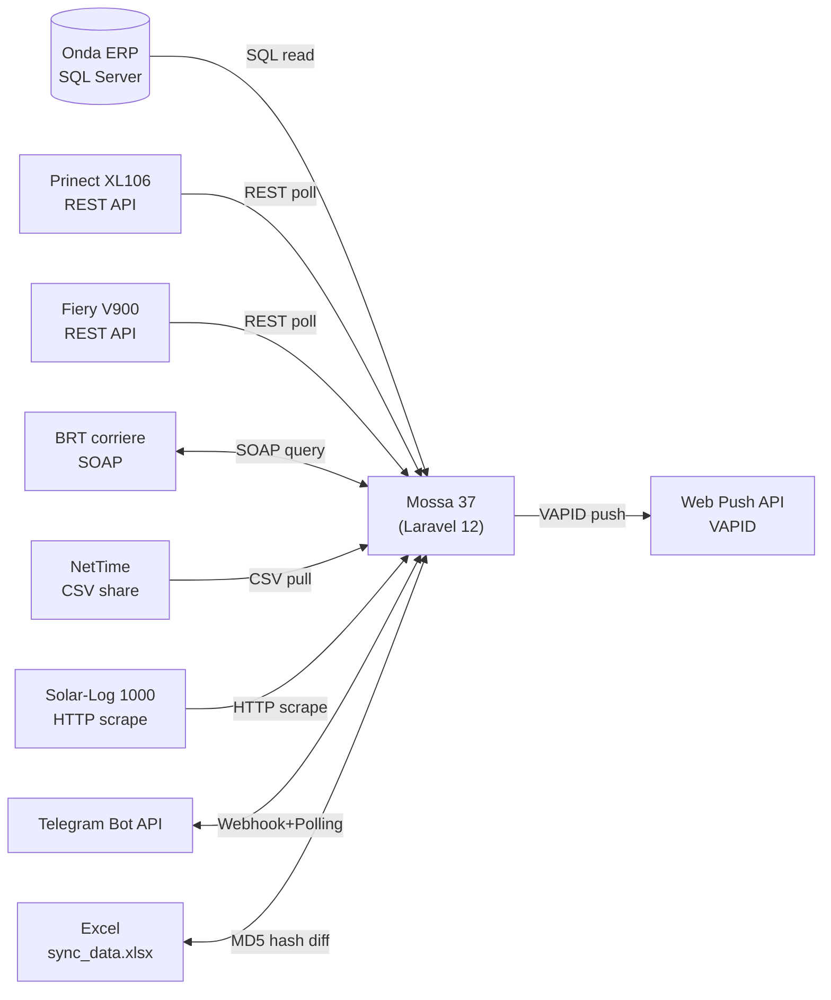

# 05. Integrazioni Esterne

Il Mossa 37 è integrato con **9 sistemi esterni**: 1 ERP, 2 macchine stampa, 1 corriere, 1 sistema presenze, 1 monitoring FV, 1 bot Telegram, 1 file Excel bidirezionale, 1 web push.

## Diagramma di alto livello



---

## 1. Onda ERP (SQL Server)

| Voce | Valore |
|---|---|
| Tipo | ERP commerciale |
| Protocollo | SQL Server T-SQL via Laravel DatabaseManager |
| Connection | `onda` (config/database.php) |
| Credenziali | env `DB_ONDA_HOST`, `DB_ONDA_USERNAME`, `DB_ONDA_PASSWORD`, `DB_ONDA_DATABASE` |
| Direzione | MES legge (read-only) |
| Frequenza | Ogni ora (cron `onda:sync`) |

**File coinvolti:**
- `app/Modules/Onda/Adapters/OndaErpAdapter.php` — Query SQL Server
- `app/Modules/Onda/Contracts/OndaErpInterface.php` — Contract
- `app/Modules/Onda/Services/OrdineSyncService.php` — Orchestrazione ordini
- `app/Modules/Onda/Services/CommessaSyncService.php` — Sync singola commessa
- `app/Console/Commands/SyncOnda.php` — Comando artisan
- `app/Services/OndaSyncService.php` — Wrapper compatibilità

**Tabelle Onda lette:**

| Tabella | Uso |
|---|---|
| `ATTDocTeste` | Header documenti: `TipoDocumento`=2 ordini, 3 DDT vendita, 7 DDT fornitore |
| `ATTDocRighe` | Righe documenti: `CodArt`, `Descrizione` (live), `Qta`, `TipoRiga` (1=articolo, 2=fase) |
| `PRDDocTeste` | Header commesse produzione |
| `PRDDocFasi` | Fasi produzione: `CodFase`, `CodMacchina`, `QtaDaLavorare` |
| `PRDDocRighe` | Materiali commessa, costi |
| `OC_ATTDocRigheExt` | Specifiche supporto: `SuppBaseCM`, `SuppAltezzaCM`, `Resa`, `TotSupporti` |
| `PRDMacchinari` | Scarti previsti per macchina (`OC_FogliScartoIniz`) |
| `STDAnagrafiche` | Anagrafica clienti (`RagioneSociale`) |

**Query principali:**
- `getOrdiniDal(Carbon $dal)` — Ordini con `DataRegistrazione >= $dal` (default 7gg)
- `getOrdiniPerCommessa(string $codCommessa)` — Singola commessa (no filtro data)
- `getScartiPrevistiPerMacchina()` — Mapping macchina → scarti

**Comando artisan:**
```
php artisan onda:sync           # sync ordini ultimi 7gg
php artisan onda:sync 0067339-26 # sync singola commessa
```

**Note operative:**
- MES **non scrive** mai su Onda (read-only)
- Descrizione preferita: `ATTDocRighe.Descrizione` (commerciale live) con fallback `OC_Descrizione` (PRD stale)
- Lookup ordine: match commessa + cod_art + descrizione, fallback su commessa+cod_art per gestire revisioni OC
- Eventi: `OrdineSincronizzato`, `ClienteSincronizzato`

---

## 2. Prinect (Heidelberg XL106, REST)

| Voce | Valore |
|---|---|
| Tipo | Workflow stampa offset |
| Protocollo | REST + Basic Auth |
| Base URL | env `PRINECT_API_URL` |
| Direzione | MES legge (read-only) |
| Frequenza polling | Ogni 5 minuti (cron `prinect:sync-attivita`), on-demand dashboard 15-30s |
| Cache | 60s jobs/accounting, 30s server status, fallback stale 30min |

**File coinvolti:**
- `app/Http/Services/PrinectService.php` — Wrapper legacy
- `app/Modules/Prinect/Adapters/PrinectHttpAdapter.php` — Adapter modulare
- `app/Modules/Prinect/Contracts/PrinectApiInterface.php`
- `app/Modules/Prinect/Services/PrinectJobsService.php`
- `app/Modules/Prinect/Services/PrinectInkService.php`
- `app/Modules/Prinect/Services/PrinectAccountingService.php`
- `app/Modules/Prinect/Services/PrinectAutoTerminaService.php`

**Endpoint principali:**

| Endpoint | Uso |
|---|---|
| `GET /rest/device` | Lista device + status |
| `GET /rest/devicegroup` | Device grouping |
| `GET /rest/job/{jobId}` | Dettaglio job |
| `GET /rest/job/{jobId}/element` | Elementi job |
| `GET /rest/job/{jobId}/workstep/{wsId}/activity` | Attività workstep (timestamps) |
| `GET /rest/job/{jobId}/workstep/{wsId}/preview` | Anteprima foglio stampa |
| `GET /rest/job/{jobId}/workstep/{wsId}/quality` | Quality data (scarti) |
| `GET /rest/job/{jobId}/workstep/{wsId}/ink` | Consumo inchiostro CMYK |
| `GET /rest/employee` | Operatori Prinect |
| `GET /rest/version` | API version |

**Dati letti:**
- Device activity (CPU, memory, job count)
- Job metadata (id, status, modified date)
- Workstep execution (activities, previews, quality scores, ink usage)
- Mapping `jobId → commessa`: ltrim primi 7 char commessa, numerico

**Comando artisan:**
```
php artisan prinect:sync-attivita  # storico 7gg
```

**Note operative:**
- Auto-termina: workstep COMPLETED senza `actualStartDate` → terminate fase MES (fix bug commessa 66811)
- Auto-ripristino: fase MES stato=3 con attività Prinect recenti → ripristina stato=2
- Device ID XL106: env `PRINECT_DEVICE_XL106_ID` (default 4001)

---

## 3. Fiery (Canon V900, REST)

| Voce | Valore |
|---|---|
| Tipo | Workflow stampa digitale |
| Protocollo | REST + Cookie session auth |
| Base URL | `config('fiery.host')` |
| API version | v5 |
| Direzione | MES legge (read-only) |
| Frequenza | Ogni minuto (cron `fiery:sync`) |
| Cache | 30s status, 60s jobs/accounting, 1h info, 24h version |

**File:** `app/Http/Services/FieryService.php`

**Endpoint:**

| Endpoint | Uso |
|---|---|
| `POST /live/api/v5/login` | Auth (session cookie) |
| `GET /live/api/v5/server/status` | Health server (ready/processing/error) |
| `GET /live/api/v5/jobs` | Job queue (id, state, copies, sheets) |
| `GET /live/api/v5/accounting` | Ledger per commessa |
| `GET /live/api/v5/consumables` | Toner CMYK + carta + waste |
| `GET /live/api/v5/info` | Server info (firmware, capabilities) |

**Dati letti:**
- Server status, queue job
- Accounting per commessa (fogli, copie, history)
- Consumables (toner, carta, waste toner)

**Comandi artisan:**

| Comando | Frequenza |
|---|---|
| `php artisan fiery:sync` | Ogni minuto |
| `php artisan fiery:snapshot-contatori` | Feriali 16:55 (pre-shutdown 17:00) |
| `php artisan fiery:export-contatori --mese-corrente --email={REPORT_CONTATORI_TO}` | Ultimo del mese 17:00 |

**Note operative:**
- Fallback stale cache 30 minuti se chiamate live falliscono (resilienza dashboard)
- Categorie contatori (`fiery_contatori`): grouping fogli per categoria/mese/anno

---

## 4. BRT (SOAP corriere)

| Voce | Valore |
|---|---|
| Tipo | Corriere espresso |
| Protocollo | SOAP 1.1 su HTTPS (TLS) |
| Auth | `CLIENTE_ID` userID in SOAP body |
| Direzione | MES query tracking |
| Frequenza | On-demand (click dashboard) |

**File:** `app/Http/Services/BrtService.php`

**WSDL:**
- `https://<endpoint BRT>/web/GetIdSpedizioneByRMAService/GetIdSpedizioneByRMA?wsdl`
- `https://<endpoint BRT>/web/BRT_TrackingByBRTshipmentIDService/BRT_TrackingByBRTshipmentID?wsdl`

**Dati letti:**
- Shipment ID da DDT (`RIFERIMENTO_MITTENTE_ALFABETICO` o `RIFERIMENTO_MITTENTE_NUMERICO`)
- Tracking completo: data/ora consegna, destinatario, firma, peso/colli, eventi
- Bolla: indirizzi mittente/destinatario, servizio, porto, filiale

**Note operative:**
- WSDL rewrite HTTP → HTTPS (bug BRT legacy WSDL)
- Temp WSDL file creato con permessi 0600, auto-clean shutdown
- Search strategy multi-anno: alfabetico anno corrente → anno prec → numerico (gestisce DDT cross-anno)
- Esito `-22` = MULTI-spedizione (filtrata da email ritardi e da alert)
- SSL verify: env `BRT_VERIFY_SSL` (default false in dev, true in prod)

---

## 5. NetTime (presenze)

| Voce | Valore |
|---|---|
| Tipo | Sistema biometrico presenze |
| Server NetTime | `<IP gestione presenze>` (Antonio IT) |
| Share export | `\\<IP ERP>\nettime_timbrature\` |
| Protocollo | Lettura CSV da Windows share |
| Direzione | MES legge (one-way pull) |
| Frequenza | Ogni minuto feriali 05-23 |

**File:**
- `app/Modules/Presenze/Adapters/NetTimeShareAdapter.php`
- `app/Modules/Presenze/Services/TimbratureSyncService.php`
- `app/Console/Commands/Presenze*.php`

**Comandi artisan:**

| Comando | Frequenza |
|---|---|
| `php artisan presenze:sync` | Ogni minuto feriali 05-23 |
| `php artisan presenze:export-excel` | Ogni 15 min feriali 05-23 |

**Env config:**
- `NETTIME_SHARE_USER`, `NETTIME_SHARE_PASS` (credenziali share)
- TODO: `NETTIME_PC_USER`, `NETTIME_PC_PASS`, `NETTIME_EXPORT_CMD` (per cron remoto su PC NetTime)

**Note operative:**
- Procedura sindacale art. 4 Statuto Lavoratori richiesta prima di rollout produttività individuale
- Informativa GDPR art. 13 firmata da ogni dipendente

---

## 6. Solar-Log 1000 (monitoring FV)

| Voce | Valore |
|---|---|
| Tipo | Monitoring impianto fotovoltaico |
| Dispositivo | Solar-Log 1000, firmware 2.8.3 (2013) |
| Impianto | 180 kWp, 7 inverter Power-One PVI-TRIO |
| IP locale | `<IP gestione presenze>` (MAC `00-19-99-df-96-b0`) |
| Portale cloud | `https://solarlog-portal.it` |
| Direzione | MES legge (scrape) |
| Stato | Integrazione in corso |

**Endpoint portale:**
- Login: `POST https://solarlog-portal.it/974821.html` (username/password/action=login)
- Pagina rendimenti: `https://solarlog-portal.it/emulated_yieldov_3650.html` (con session cookie)

**Note operative:**
- API locale `/getjp` non supportata (firmware 2013 troppo vecchio)
- IIS sul PC dedicato intercetta porta 80 (conflitto, non risolvibile)
- FTP `websu.solarlog-portal.it` ritorna errore 530 (IP-restricted)
- Soluzione: scrape pagina rendimenti via login + session cookie

---

## 7. Telegram Bot

| Voce | Valore |
|---|---|
| Tipo | Bot messaggistica (input bolle magazzino + alert) |
| Protocollo | HTTPS Webhook + Bot API long polling |
| Token | env `TELEGRAM_BOT_TOKEN` |
| Direzione | Bidirezionale |
| Frequenza | Real-time webhook / 30s polling |

**File:**
- `app/Http/Controllers/TelegramWebhookController.php`
- `app/Console/Commands/TelegramPoll.php`
- `app/Services/BollaAIService.php` — Claude Vision API per OCR foto bolle

**Endpoint MES:**
- `POST /telegram/webhook/{secret}` — Webhook con HMAC-SHA256 constant-time verify

**Comando artisan:**
```
php artisan telegram:poll --timeout=30  # long polling 30s
php artisan telegram:poll --once         # single cycle
```

**Comandi bot:**
`/start`, `/help`, `/id`, `/ping`, `/status`, `/giacenza`, `/articoli`, `/alert`, `/movimenti`, `/carico`

**AI integration:**
- `BollaAIService::analizzaBolla()` via Claude Vision API
- Input: foto bolla via Telegram
- Output: parsing campi (articolo, qta, lotto, fornitore) → registrazione movimento magazzino auto
- Env: `ANTHROPIC_API_KEY`

**Deploy:**
- Windows service via `nssm` chiamato `Mossa37TelegramBot` (auto-restart)
- Webhook e polling **mutuamente esclusivi**: rimuovere webhook prima di avviare polling

**Sicurezza:**
- Secret webhook string ≥16 caratteri (regex validate)
- Verifica constant-time `hash_equals()` (HMAC-SHA256 su JSON body)

---

## 8. Excel bidirezionale

| Voce | Valore |
|---|---|
| Tipo | File scambio dati MES ↔ Excel utente |
| Path | env `EXCEL_SYNC_PATH` o `storage/app/excel_sync/sync_data.xlsx` |
| Protocollo | XLSX (PhpSpreadsheet) + MD5 hash detection |
| Direzione | Bidirezionale |
| Frequenza | Cron ogni 2 min (`excel:sync`) + on-page-load |

**File:**
- `app/Http/Services/ExcelSyncService.php` (legacy)
- `app/Modules/Documenti/Services/ExcelSyncService.php` (nuovo modulo)

**State files (stessa cartella):**
- `.last_sync_timestamp`
- `.last_sync_hash` (MD5)
- `.last_exported_ids`

**Logica:**
- **syncIn**: legge `sync_data.xlsx`, calcola MD5, confronta con `.last_sync_hash`
  - Se diverso: parsing colonne A-AJ, raggruppa per commessa, aggiorna campi `OrdineFase` corrispondenti
  - Riga eliminata da Excel = soft-delete fase MES
  - Propaga modifiche data consegna a tutti ordini stessa commessa
- **syncOut**: export current state DB → xlsx, aggiorna state files

**Comando artisan:**
```
php artisan excel:sync  # ogni 2 minuti
```

---

## 9. Web Push (browser notifications)

| Voce | Valore |
|---|---|
| Tipo | Browser push notifications |
| Protocollo | Web Push API + VAPID |
| Direzione | MES invia |
| Frequenza | On-event |

**File:**
- `app/Http/Controllers/PushController.php`
- `app/Modules/Notifiche/Senders/BrowserPushSender.php`

**Endpoint:**
- `POST /push/subscribe` — Registra subscription
- `POST /push/unsubscribe` — Cancella
- `GET /push/vapid-key` — Public key VAPID

**Tabella:** `push_subscriptions`

**Eventi inviati:**
- Spedizione: nuova fase pronta consegna
- Owner: nota consegna nuova da spedizione
- Magazzino: giacenza sotto soglia
- Presenze: alert non-timbrato

---

## Tabella riepilogativa

| Sistema | Protocollo | Direzione | Frequenza | Comando artisan |
|---|---|---|---|---|
| Onda ERP | SQL Server | Read | Ogni ora | `onda:sync [commessa]` |
| Prinect | REST Basic | Read | 5 min cron + on-demand | `prinect:sync-attivita` |
| Fiery | REST Cookie | Read | 1 min | `fiery:sync`, `fiery:snapshot-contatori`, `fiery:export-contatori` |
| BRT | SOAP/HTTPS | Query | On-demand | — |
| NetTime | CSV share | Pull | 1 min feriali | `presenze:sync`, `presenze:export-excel` |
| Solar-Log | HTTP scrape | Read | TBD | TBD (in corso) |
| Telegram | Webhook + polling | Bidirezionale | Real-time / 30s | `telegram:poll` |
| Excel | XLSX + MD5 | Bidirezionale | 2 min | `excel:sync` |
| Web Push | VAPID | Send | On-event | — |

---

## Considerazioni multi-tenant per deploy partner

| Aspetto | Da configurare per ogni tenant |
|---|---|
| Onda | Hostname + credenziali SQL Server (potrebbe NON essere Onda — sostituibile via swap Adapter) |
| Prinect | Base URL + Basic Auth + device ID XL106 (se cliente non ha XL106, modulo Prinect disattivato) |
| Fiery | Host + credenziali (se cliente non ha Fiery, modulo Fiery disattivato) |
| BRT | Cliente ID + credenziali (se cliente usa altro corriere → adapter custom) |
| NetTime | Path share + credenziali (sostituibile con altro timbratore via swap Adapter) |
| Telegram | Bot token dedicato per ogni tenant |
| Push | VAPID keys per ogni tenant |

Tutte le integrazioni passano da **Contracts + Adapters** → per integrare un cliente con stack diverso (es. SAP invece di Onda) basta scrivere un nuovo Adapter senza toccare business logic.
