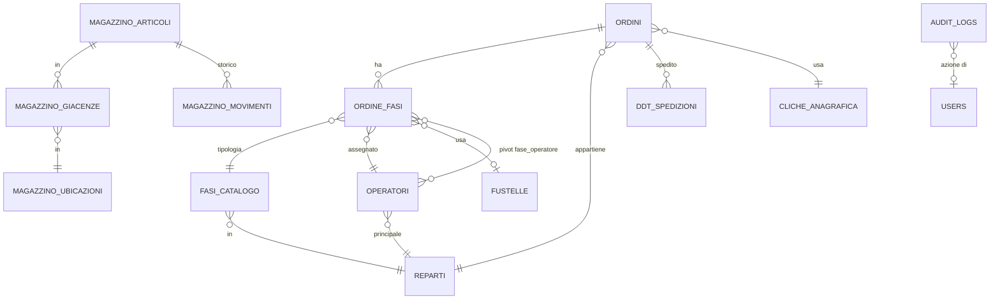

# 06. Database

## Overview

| Voce | Valore |
|---|---|
| DBMS operativo | MySQL 8 |
| Schema | `mossa37` |
| Migrations totali | 115 |
| Model Eloquent | 28 |
| Host | <host DB locale> () |
| Charset | utf8mb4 |
| Engine | InnoDB |

DBMS aggiuntivo: **SQL Server Onda** (connection `onda`) — solo lettura, vedi `05-integrations.md`.

## Diagramma ER (alto livello)



## I 28 Model

| Model | Tabella | Soft Delete |
|---|---|---|
| Ordine | ordini | No |
| OrdineFase | ordine_fasi | Sì |
| FasiCatalogo | fasi_catalogo | No |
| Fase | fasi | No (legacy) |
| Operatore | operatori | No |
| Reparto | reparti | No |
| Assegnazione | assegnazioni | No |
| PausaOperatore | pausa_operatores | No |
| DdtSpedizione | ddt_spedizioni | No |
| NotaSpedizione | note_spedizione | No |
| MagazzinoArticolo | magazzino_articoli | No |
| MagazzinoGiacenza | magazzino_giacenze | No |
| MagazzinoMovimento | magazzino_movimenti | No |
| MagazzinoUbicazione | magazzino_ubicazioni | No |
| MagazzinoEtichetta | magazzino_etichette | No |
| Fustella | fustelle | No |
| ClicheAnagrafica | cliche_anagrafica | No (legacy) |
| Articolo | articoli | No |
| User | users | No |
| CostoReparto | costi_reparti | No |
| PrinectAttivita | prinect_attivita | No |
| ChatMessage | chat_messages | No |
| ContatoreStampante | contatori_stampanti | No |
| EanProdotto | ean_prodotti | No |
| FieryAccounting | fiery_accounting | No |
| OperatoreToken | operatore_tokens | No |
| NotaTurno | note_turni | No |
| PushSubscription | push_subscriptions | No |

> **AuditLog** (modulo Audit) usa tabella `audit_logs` ma non è Model Eloquent — accesso via service.

---

## Tabelle critiche (dettaglio)

### `ordini` — Ordini cliente

```sql
id                      BIGINT PK AUTO_INCREMENT
commessa                VARCHAR(255) INDEX
cliente_nome            VARCHAR(255) INDEX
cod_art                 VARCHAR(255) NULL
descrizione             TEXT
qta_richiesta           INTEGER
qta_prodotta            INTEGER DEFAULT 0
um                      VARCHAR(10) DEFAULT 'FG'
stato                   TINYINT DEFAULT 0       -- 0=non iniziato, 1=in lav, 2=terminato
priorita                INTEGER DEFAULT 0
data_registrazione      DATE
data_prevista_consegna  DATE NULL
pronto_consegna         BOOLEAN DEFAULT false
note                    TEXT
ore_lavorate            DECIMAL(6,2) NULL
timeout_macchina        DECIMAL(6,2) NULL
cliche_numero           INTEGER NULL FK→cliche_anagrafica(numero)
cliche_match_type       VARCHAR NULL
cliche_matched_at       DATETIME NULL
ddt_vendita_id          BIGINT NULL
numero_ddt_vendita      VARCHAR NULL
vettore_ddt             VARCHAR NULL
qta_ddt_vendita         DECIMAL NULL
cod_carta               VARCHAR NULL
carta                   VARCHAR NULL
qta_carta               INTEGER NULL
UM_carta                VARCHAR(10) NULL
supp_base_cm            INTEGER NULL
supp_altezza_cm         INTEGER NULL
resa                    INTEGER NULL
tot_supporti            INTEGER NULL
valore_ordine           DECIMAL NULL
costo_materiali         DECIMAL NULL
note_prestampa          TEXT
responsabile            TEXT
commento_produzione     TEXT
note_fasi_successive    TEXT (JSON array)
ordine_cliente          VARCHAR NULL
created_at, updated_at  TIMESTAMP
```

**Relazioni Eloquent:**
```php
hasMany(OrdineFase)
hasMany(Articolo)
hasMany(Assegnazione)
hasMany(PausaOperatore)
belongsTo(Reparto)
belongsTo(ClicheAnagrafica, 'cliche_numero', 'numero')
hasMany(DdtSpedizione)
hasManyThrough(Operatore, OrdineFase)
```

**Indici:** `commessa`, `cliente_nome`

---

### `ordine_fasi` — Fasi di produzione (CORE)

Tabella con **SOFT DELETE** (`deleted_at`).

```sql
id                      BIGINT PK
ordine_id               BIGINT FK→ordini ON DELETE CASCADE
fase_catalogo_id        BIGINT FK→fasi_catalogo
operatore_id            BIGINT FK→operatori NULL
fase                    VARCHAR(255)
stato                   TINYINT DEFAULT 0       -- 0=caricato, 1=pronto, 2=avviato,
                                                -- 3=terminato, 4=consegnato, 5=esterno
data_inizio             TIMESTAMP NULL
data_fine               TIMESTAMP NULL
reparto                 VARCHAR NULL
qta_prod                INTEGER DEFAULT 0
scarti                  INTEGER NULL
tiro                    DECIMAL NULL
qta_fase                INTEGER NULL
um                      VARCHAR(10) NULL
note                    TEXT
priorita                INTEGER DEFAULT 0
priorita_manuale        BOOLEAN NULL
esterno                 BOOLEAN DEFAULT false
terminata_manualmente   BOOLEAN DEFAULT false
manuale                 BOOLEAN DEFAULT false
ore                     DECIMAL NULL
tipo_consegna           VARCHAR NULL
ddt_fornitore_id        BIGINT NULL
segnacollo_brt          VARCHAR NULL
scarti_previsti         INTEGER NULL
riaperta_at             TIMESTAMP NULL
qta_prod_at_riapertura  INTEGER NULL
deleted_at              TIMESTAMP NULL          -- soft delete

-- Colonne Mossa 37 (scheduler)
sequenza                INTEGER
disponibile             BOOLEAN DEFAULT false
disponibile_m37         BOOLEAN DEFAULT false
urgenza_reale           DECIMAL(8,2) NULL
fascia_urgenza          INTEGER NULL
giorni_lavoro_residuo   DECIMAL(8,2) NULL
batch_key               VARCHAR NULL
sequenza_m37            INTEGER
priorita_m37            INTEGER
sched_posizione         VARCHAR NULL
sched_macchina          VARCHAR NULL
sched_inizio            DATETIME NULL
sched_fine              DATETIME NULL
sched_setup_h           DECIMAL NULL
sched_setup_tipo        VARCHAR NULL
sched_batch_group       VARCHAR NULL
sched_calcolato_at      TIMESTAMP NULL

created_at, updated_at  TIMESTAMP
```

**Relazioni:**
```php
belongsTo(Ordine)
belongsTo(Operatore)
belongsTo(FasiCatalogo)
belongsToMany(Operatore, 'fase_operatore', withPivot('data_inizio','data_fine','secondi_pausa'))
hasOneThrough(Reparto, FasiCatalogo)
```

**Casts:** boolean (`disponibile`, `disponibile_m37`, `priorita_manuale`, `esterno`), integer (`sequenza`, `sequenza_m37`, `fascia_urgenza`)

**Indici critici:** `ordine_id`, `fase_catalogo_id`, `operatore_id`, `stato`, `deleted_at`, `priorita_m37` (perf indices da migrations 2026-04-20 + 2026-05-06)

---

### `fasi_catalogo` — Catalogo fasi disponibili

```sql
id                      BIGINT PK
nome                    VARCHAR(255)
reparto_id              BIGINT FK→reparti
pronto_consegna         DECIMAL(8,2) NULL
avviamento              DECIMAL(8,2) NULL
copie_ora               INTEGER NULL
unita_misura            VARCHAR NULL
created_at, updated_at  TIMESTAMP
```

**Relazione:** `belongsTo(Reparto)`

---

### `operatori` — Operatori (auth guard `operatore`)

```sql
id                      BIGINT PK
nome                    VARCHAR(255)
cognome                 VARCHAR(255) NULL
codice_operatore        VARCHAR(255) UNIQUE     -- alfanumerico, es. "RB", "MIR"
reparto                 VARCHAR NULL            -- legacy
reparto_id              BIGINT FK→reparti NULL
ruolo                   VARCHAR DEFAULT 'operatore'
                                                -- operatore|superadmin|owner|admin|
                                                --  prestampa|spedizione|fiery_contatori|
                                                --  owner_readonly
attivo                  BOOLEAN DEFAULT true
password                VARCHAR(255) NULL
remember_token          VARCHAR NULL
created_at, updated_at  TIMESTAMP
```

**Relazioni:**
```php
hasMany(Assegnazione)
hasMany(PausaOperatore)
belongsToMany(OrdineFase, 'fase_operatore', withPivot('data_inizio','data_fine','secondi_pausa'))
belongsTo(Reparto)
belongsToMany(Reparto, 'operatore_reparto')
hasMany(MagazzinoMovimento)
```

**Auth Guard:** `operatore` (config/auth.php)

---

### `reparti` — Reparti produttivi

```sql
id              BIGINT PK
nome            VARCHAR(255) UNIQUE
codice          VARCHAR NULL
created_at, updated_at TIMESTAMP
```

**Relazioni:** `hasMany(FasiCatalogo)`, `hasMany(Fase)`, `hasMany(CostoReparto)` orderByDesc(`valido_dal`)

**12 reparti standard:** prestampa, stampa offset, digitale, finitura digitale, plastica, plastica lux, caldo, fustella, piegaincolla, legatoria, spedizione, esterno.

---

### `magazzino_articoli` — Anagrafica magazzino

```sql
id                BIGINT PK
codice            VARCHAR(255) UNIQUE
descrizione       VARCHAR(255)
categoria         VARCHAR NULL  -- carta|foil|scatoloni|inchiostro|vernici
formato           VARCHAR NULL
grammatura        INTEGER NULL
spessore          DECIMAL(5,3) NULL
um                VARCHAR(10) DEFAULT 'fg'
soglia_minima     DECIMAL(2) DEFAULT 0
fornitore         VARCHAR NULL
certificazioni    VARCHAR NULL
attivo            BOOLEAN DEFAULT true
created_at, updated_at TIMESTAMP
```

**Metodi:**
- `giacenzaTotale(): int` — somma giacenze tutte ubicazioni
- `sottoSoglia(): bool` — controllo soglia minima

**Relazioni:** `hasMany(MagazzinoGiacenza)`, `hasMany(MagazzinoMovimento)`, `hasMany(MagazzinoEtichetta)`

---

### `magazzino_giacenze` — Giacenze per ubicazione

```sql
id                  BIGINT PK
articolo_id         BIGINT FK→magazzino_articoli
ubicazione_id       BIGINT FK→magazzino_ubicazioni NULL
quantita            INTEGER DEFAULT 0
lotto               VARCHAR NULL
data_ultimo_carico  DATE NULL
data_ultimo_scarico DATE NULL
created_at, updated_at TIMESTAMP

UNIQUE(articolo_id, ubicazione_id, lotto)
```

---

### `magazzino_movimenti` — Storico movimenti

```sql
id              BIGINT PK
articolo_id     BIGINT FK→magazzino_articoli
ubicazione_id   BIGINT FK→magazzino_ubicazioni NULL
tipo            VARCHAR  -- scarico|carico|reso|rettifica
quantita        DECIMAL(2)
giacenza_dopo   DECIMAL(2)
lotto           VARCHAR NULL
fornitore       VARCHAR NULL
commessa        VARCHAR NULL
fase            VARCHAR NULL
operatore_id    BIGINT FK→operatori NULL
note            TEXT NULL
foto_bolla      VARCHAR NULL  -- path foto Telegram
ocr_raw         TEXT NULL     -- output Claude Vision OCR
created_at, updated_at TIMESTAMP
```

---

### `fustelle` — Anagrafica fustelle (nuova)

```sql
id                  BIGINT PK
codice              VARCHAR(20) UNIQUE  -- F-NNNNN-X
tipo                ENUM('PIANA','ROTATIVA','TRANCIATURA','RILIEVO')
stato               ENUM('PREPARAZIONE','PRONTA','IN_USO','ARCHIVIATA')
dimensione_mm_x     UNSIGNED INT NULL
dimensione_mm_y     UNSIGNED INT NULL
spessore_mm         DECIMAL(5,2) NULL
posizione_magazzino VARCHAR(50) NULL
note                TEXT NULL
created_at, updated_at TIMESTAMP
```

**Casts:** `TipoFustella` enum, `StatoFustella` enum.

---

### `cliche_anagrafica` — Legacy fustelle/cliché

```sql
id              BIGINT PK
numero          INTEGER UNIQUE
descrizione_raw VARCHAR(500)
qta             INTEGER NULL
scatola         INTEGER NULL
note            VARCHAR(500) NULL
created_at, updated_at TIMESTAMP
```

> Tabella **legacy**. La nuova è `fustelle` (sopra). Coesistono in attesa di migrazione completa.

---

### `ddt_spedizioni` — DDT MES

```sql
id                  BIGINT PK
onda_id_doc         UNSIGNED BIGINT
numero_ddt          VARCHAR(20)
data_ddt            DATE NULL
vettore             VARCHAR(100) NULL
cliente_nome        VARCHAR(150) NULL
commessa            VARCHAR(20)
ordine_id           UNSIGNED BIGINT FK→ordini ON DELETE SET NULL
qta                 DECIMAL(10,2) NULL
brt_stato           VARCHAR NULL
brt_data_consegna   DATE NULL
brt_destinatario    VARCHAR NULL
brt_colli           VARCHAR NULL
brt_cache_at        DATETIME NULL
created_at, updated_at TIMESTAMP

UNIQUE(onda_id_doc, commessa)
```

**Relazione:** `belongsTo(Ordine)`

---

### `audit_logs` — Audit log eventi

```sql
id          BIGINT PK
user_id     UNSIGNED BIGINT NULL
user_name   VARCHAR(100) NULL
action      VARCHAR(50)  -- login|logout|update|create|delete|sync|export|read|failed
model       VARCHAR(100) NULL
model_id    UNSIGNED BIGINT NULL
old_values  JSON NULL
new_values  JSON NULL
ip          VARCHAR(45) NULL
user_agent  VARCHAR(500) NULL
extra       TEXT NULL
created_at  TIMESTAMP DEFAULT CURRENT_TIMESTAMP
```

**Indici:** `user_id`, `action`, `model`, `created_at`, composite (`model`, `model_id`)

**Retention automatica:** comando `audit:pulisci` giornaliero 03:00, default 90 giorni (configurabile per livello sicurezza: Normale 3yr, Sensibile 2yr, Critico 7yr).

---

### `users` — Admin (auth guard `web`)

```sql
id                  BIGINT PK
name                VARCHAR(255)
email               VARCHAR(255) UNIQUE
password            VARCHAR(255)
email_verified_at   TIMESTAMP NULL
remember_token      VARCHAR NULL

-- 2FA
2fa_secret          VARCHAR NULL
2fa_recovery_codes  TEXT NULL  -- JSON 8 codici 4-4 one-time
2fa_enabled_at      TIMESTAMP NULL

created_at, updated_at TIMESTAMP
```

---

## Pivot tables

### `fase_operatore`
Pivot OrdineFase ↔ Operatori (relazione molti-a-molti).

```sql
id                  BIGINT PK
ordine_fase_id      BIGINT FK→ordine_fasi
operatore_id        BIGINT FK→operatori
data_inizio         TIMESTAMP NULL
data_fine           TIMESTAMP NULL
secondi_pausa       INTEGER DEFAULT 0
created_at, updated_at TIMESTAMP
```

### `assegnazioni`
Pivot legacy Ordini ↔ Operatori.

```sql
id              BIGINT PK
ordine_id       BIGINT FK
operatore_id    BIGINT FK
created_at, updated_at TIMESTAMP
```

### `operatore_reparto`
Pivot Operatori ↔ Reparti (operatore multi-reparto).

```sql
id              BIGINT PK
operatore_id    BIGINT FK
reparto_id      BIGINT FK
created_at, updated_at TIMESTAMP
```

---

## Soft Delete

**Solo tabella `ordine_fasi`** usa soft delete (`deleted_at` nullable).

Motivazione: una fase può essere "eliminata" dall'owner per errore o cambiamento ordine cliente, ma serve audit storico per:
- Tracciabilità (compliance)
- Riapertura accidentale
- Ricostruzione cronologia

**Helper:**
```php
OrdineFase::withTrashed()    // include soft-deleted
OrdineFase::onlyTrashed()    // solo soft-deleted
$fase->restore()             // ripristina
$fase->forceDelete()         // hard delete (riservato admin)
```

---

## Mossa 37 (scheduler) — 17 colonne extra in `ordine_fasi`

Per supportare lo scheduler con propagazione fasi e ottimizzazione setup:

| Colonna | Tipo | Uso |
|---|---|---|
| `sequenza` | INT | Sequenza standard ciclo (config `fasi_priorita.php`) |
| `disponibile` | BOOL | Fase può essere avviata (fasi precedenti terminate) |
| `disponibile_m37` | BOOL | Disponibilità calcolata da scheduler Mossa 37 |
| `urgenza_reale` | DECIMAL(8,2) | Giorni residui (negativo = ritardo) |
| `fascia_urgenza` | INT | Banda urgenza (1=critico, 5=non urgente) |
| `giorni_lavoro_residuo` | DECIMAL | Giorni lavoro residui per completamento |
| `batch_key` | VARCHAR | Chiave raggruppamento batch (setup affinity ±5gg) |
| `sequenza_m37` | INT | Posizione ottimizzata da scheduler |
| `priorita_m37` | INT | Priorità finale (4 livelli lessicografici) |
| `sched_posizione` | VARCHAR | Posizione cronologica |
| `sched_macchina` | VARCHAR | Macchina assegnata |
| `sched_inizio` | DATETIME | Inizio pianificato |
| `sched_fine` | DATETIME | Fine pianificata |
| `sched_setup_h` | DECIMAL | Ore setup pianificate |
| `sched_setup_tipo` | VARCHAR | Tipo setup (cambio config BOBST/PI) |
| `sched_batch_group` | VARCHAR | Gruppo batch finale |
| `sched_calcolato_at` | TIMESTAMP | Quando scheduler ha calcolato |

---

## Migrations recenti (ultime 10)

| Data | Migration |
|---|---|
| 2026-05-06 | add_perf_indices_ordine_fasi |
| 2026-05-05 | add_scarico_carta_to_ordine_fasi |
| 2026-04-30 | add_qta_prod_at_riapertura_to_ordine_fasi |
| 2026-04-30 | add_riaperta_at_to_ordine_fasi |
| 2026-04-20 | add_perf_indexes_to_ordine_fasi |
| 2026-04-17 | add_tiro_to_ordine_fasi |
| 2026-04-17 | add_cliche_to_ordini |
| 2026-04-17 | create_cliche_anagrafica |
| 2026-04-16 | magazzino_on_delete_restrict |
| 2026-04-16 | fix_magazzino_audit |

---

## Note architetturali

### Dual-auth: 2 tabelle utenti

- `users` → guard `web` (admin, accesso `/admin/*`)
- `operatori` → guard `operatore` (staff produzione, accesso `/operatore/*`, `/produzione/*`, `/spedizione/*`)

Configurazione in `config/auth.php`:
```php
'guards' => [
    'web' => ['driver' => 'session', 'provider' => 'users'],
    'operatore' => ['driver' => 'session', 'provider' => 'operatori'],
],
```

### Cliché dual

- `cliche_anagrafica` (legacy Excel fustellificio, FK `ordini.cliche_numero`)
- `fustelle` (nuova tabella tipizzata, modulo Fustelle)

Migrazione in corso da legacy a nuova.

### DdtSpedizioni come bridge

Bridge tra Onda DDT e ordini MES. La unique `(onda_id_doc, commessa)` evita duplicati durante sync. La FK `ordine_id` è ON DELETE SET NULL: se l'ordine viene cancellato, il DDT mantiene tracking BRT cached.

### Magazzino: ON DELETE RESTRICT

Le FK in `magazzino_giacenze`, `magazzino_movimenti` verso `magazzino_articoli` sono RESTRICT — non si può eliminare un articolo se ha giacenze/movimenti (audit + compliance).

### `audit_logs` standalone

`user_id` è UNSIGNED BIGINT ma **NON è FK** — log conservato anche dopo eliminazione utente (compliance).
