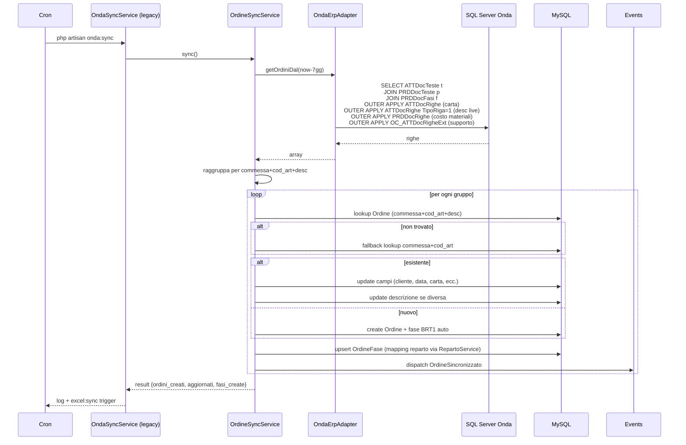
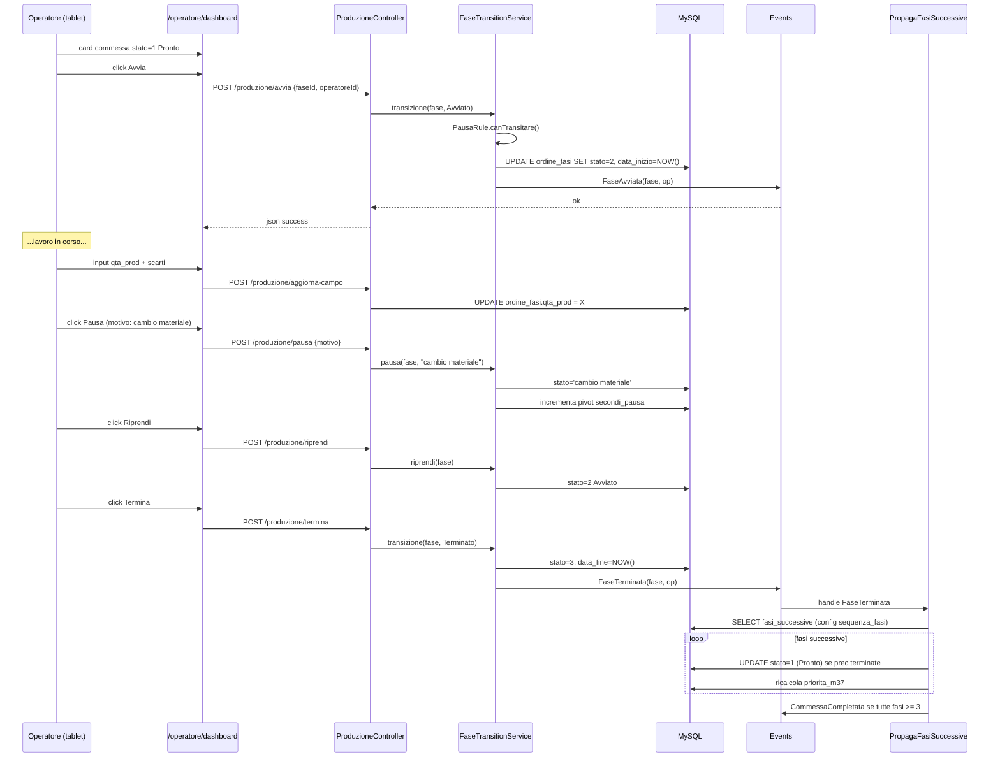
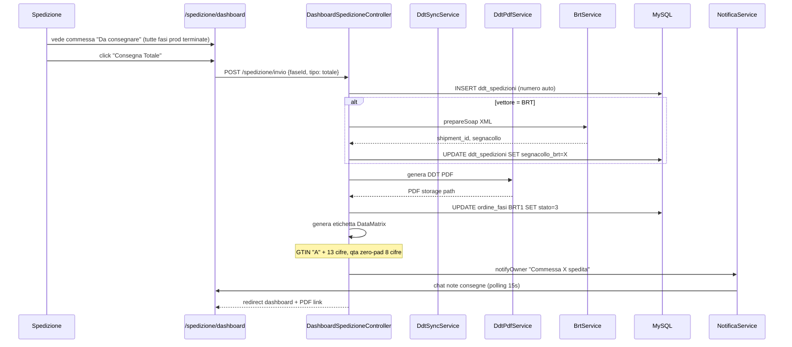
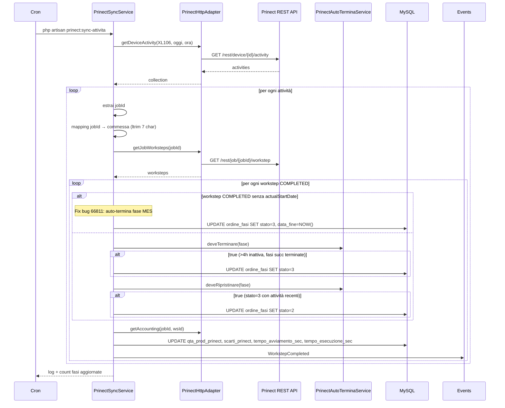
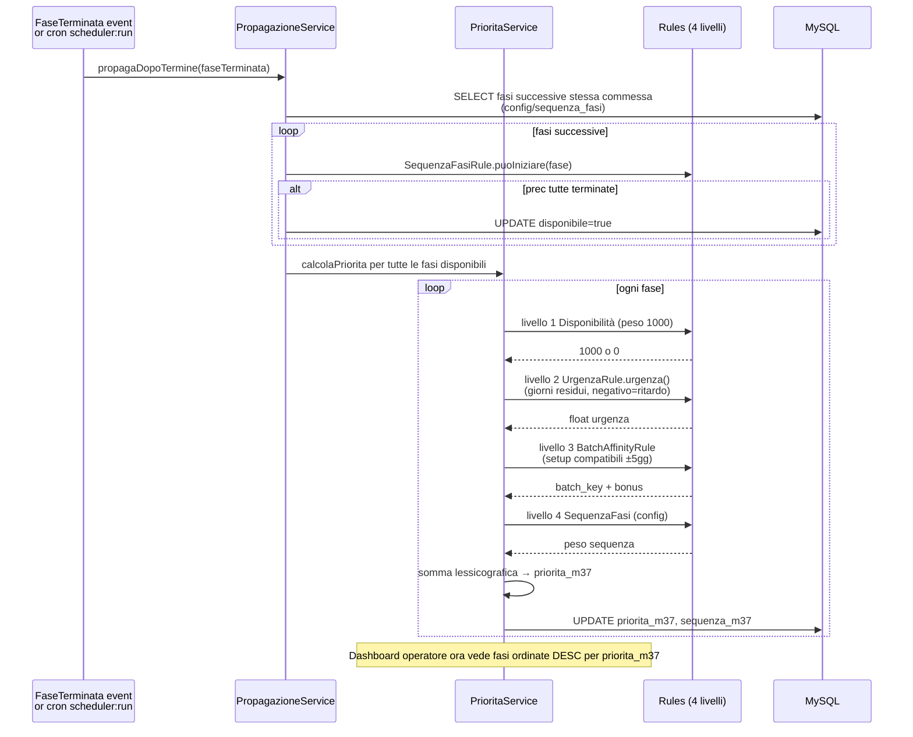
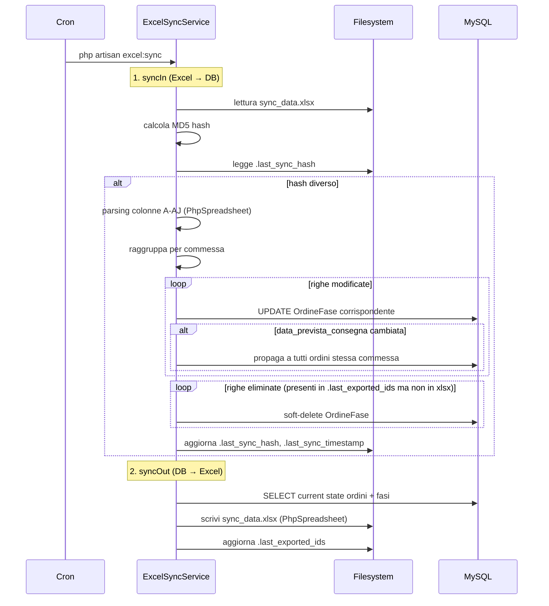
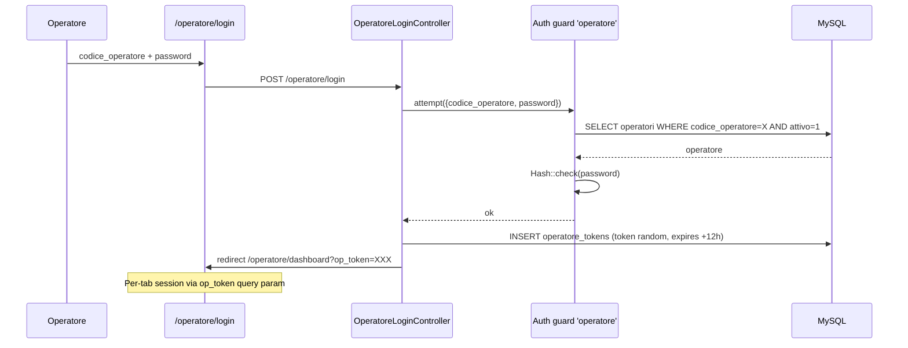
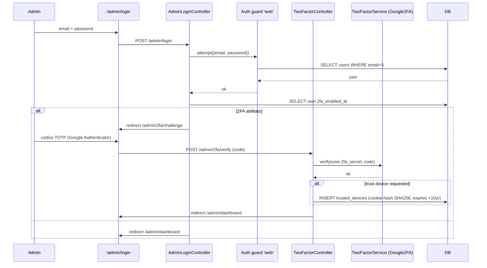

# 07. Flussi

Sequence diagrams + spiegazione step-by-step dei flussi business critici di Mossa 37.

---

## Flusso 1: Sync Onda ERP → MES

Frequenza: **ogni ora** (cron `php artisan onda:sync`).

**Note operative:**
- MES preferisce `ATTDocRighe.Descrizione` (commerciale live) su `OC_Descrizione` (PRD stale, può essere obsoleta dopo revisioni OC cliente)
- Non sovrascrive `data_prevista_consegna` se modificata manualmente nel MES
- Non sovrascrive `cliente_nome` se modificato manualmente
- Fase BRT1 (spedizione) viene auto-aggiunta per ogni nuova commessa con priorità 96
- Comando singola commessa: `php artisan onda:sync 0067339-26` (no filtro data)

**File:** `app/Modules/Onda/Services/OrdineSyncService.php`, `CommessaSyncService.php`, `Adapters/OndaErpAdapter.php`.

---

## Flusso 2: Ciclo fase operatore (Avvia → Pausa → Termina)

Attori: operatore (tablet), `ProduzioneController`, `FaseTransitionService`.

**Stati `OrdineFase.stato`:**
- 0 = NonIniziata (caricato)
- 1 = Pronto
- 2 = Avviato
- 3 = Terminato
- 4 = Consegnato
- 5 = Esterna
- stringa = Pausa con motivo

**File:** `app/Http/Controllers/ProduzioneController.php`, `app/Modules/Fasi/Services/FaseTransitionService.php`, `app/Modules/Scheduling/Services/PropagazioneService.php`.

---

## Flusso 3: Generazione DDT spedizione

**File:** `app/Http/Controllers/DashboardSpedizioneController.php`, `app/Modules/Spedizione/Services/DdtSyncService.php`, `app/Modules/Documenti/Services/EtichettaGenerator.php`.

---

## Flusso 4: Sync Prinect (stampa offset XL106)

Frequenza: **ogni 5 minuti** (cron `prinect:sync-attivita`, storico 7gg).

**File:** `app/Modules/Prinect/Services/PrinectJobsService.php`, `PrinectAutoTerminaService.php`, `Adapters/PrinectHttpAdapter.php`.

---

## Flusso 5: Scheduler Mossa 37

Trigger: `FaseTerminata` event (real-time) OPPURE cron `scheduler:run` (oggi disabled).

**Macchine specifiche:**
- XL106: 24h lun-ven (3 turni)
- JOH (caldo): 6-22 lun-ven (2 turni)
- BOBST: 1 macchina, 2 config (rilievi/fustelle), cambio config = 1h setup
- Piegaincolla: 1 macchina, 3 config (PI01/PI02/PI03), cambio config = 1h setup
- Standard 6-22: STEL, PLAST, FIN, INDIGO, TAGLIO, LEGAT, ZUND, MGI

**Colli bottiglia:** JOH > BOBST > Piegaincolla.

**File:** `app/Modules/Scheduling/Services/PrioritaService.php`, `PropagazioneService.php`, `Rules/UrgenzaRule.php`, `BatchAffinityRule.php`.

---

## Flusso 6: Sync Excel bidirezionale

Frequenza: **ogni 2 minuti** (cron `excel:sync`).

**File:** `app/Http/Services/ExcelSyncService.php` (legacy), `app/Modules/Documenti/Services/ExcelSyncService.php` (nuovo).

**State files:** `.last_sync_timestamp`, `.last_sync_hash` (MD5), `.last_exported_ids`.

---

## Flusso 7: Login operatore + Login admin con 2FA

### 7a. Login operatore (codice + password opzionale)

### 7b. Login admin con 2FA TOTP

**File:** `app/Http/Controllers/OperatoreLoginController.php`, `AdminLoginController.php`, `TwoFactorController.php`, `app/Services/TwoFactorService.php`.

**Recovery codes:** 8 codici 4-4 one-time use generati al setup 2FA.

---

## Eventi cross-modulo (catalogo completo)

| Evento | Modulo origine | Listener |
|---|---|---|
| `FaseAvviata` | Fasi | TracciaInizioFase (Audit) |
| `FaseTerminata` | Fasi | PropagaFasiSuccessive (Scheduling), NotificaCommessaCompletata (Commessa) |
| `CommessaCompletata` | Commessa | NotificaSpedizione (Notifiche), AuditLog |
| `CommessaConsegnata` | Commessa | AuditLog |
| `OrdineSincronizzato` | Onda | ExcelSync trigger (Documenti) |
| `ClienteSincronizzato` | Onda | AuditLog |
| `WorkstepAvviato` | Prinect | AuditLog |
| `WorkstepCompleted` | Prinect | UpdateOrdineFase tempi, AuditLog |
| `SottoSogliaEvento` | Magazzino | NotificaSottoSoglia (Notifiche) |
| `SpedizioneInRitardo` | Spedizione | NotificaSpedizioneInRitardo (Notifiche), EmailCliente |
| `FustellaPrelevata` | Fustelle | AuditLog |
| `FustellaRestituita` | Fustelle | AuditLog |
| `NotaFustellaAggiunta` | Fustelle | NotificaOperatore (Notifiche) |
| `TimbraturaRegistrata` | Presenze | AuditLog, CalcoloOreService |
| `OperatoreNonTimbrato` | Presenze | NotificaAlert (Notifiche) |
| `StraordinariSuperati` | Presenze | NotificaAlert (Notifiche), AuditLog |
| `RepartoCapacitaSuperata` | Reparti | NotificaOwner (Notifiche) |

Tutti dispatchati via Laravel Events (`event(new EventClass(...))`) e handler in `app/Modules/<Modulo>/Listeners/`.

Registrazione listener: `app/Providers/EventServiceProvider.php` o auto-discovery con `__invoke()` listener.
